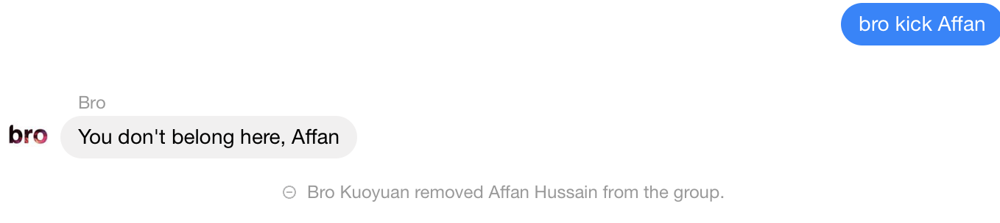
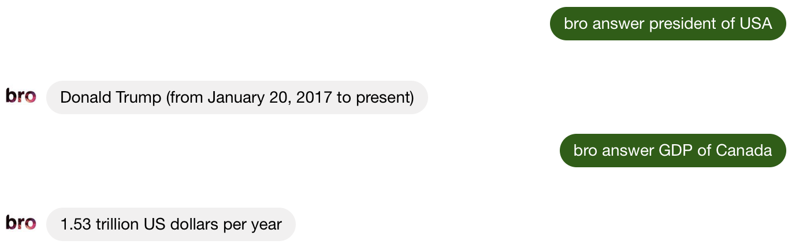

# bro-bot
facebook chat bot that parses messages and react or execute commands from users
     
## Here are different ways to use the bot:

    





### Brobot can also respond to various types of questions



    
## Set up
First clone the repository:
```
$ git clone https://github.com/y9y9l5m6/bro-bot.git
```
Go into bro-bot directory:
```
$ cd bro-bot
```
Install all dependencies:
```
$ npm install
```
Go into login.js and enter your email and password:
```javascript
login({email: "YOUR EMAIL", password: "YOUR PASSWORD"}, (err, api) => {
    if(err) return console.error(err);
});
```
Run login.js to generate appstate.json file
```
$ node login.js
```
In listen.js file, change the API keys to your own API keys
```javascript
const wordKey = "API key"
const wolframKey = "wolframKey"
```
Now run:
```
$ node listen.js
```
Your bot is running!
